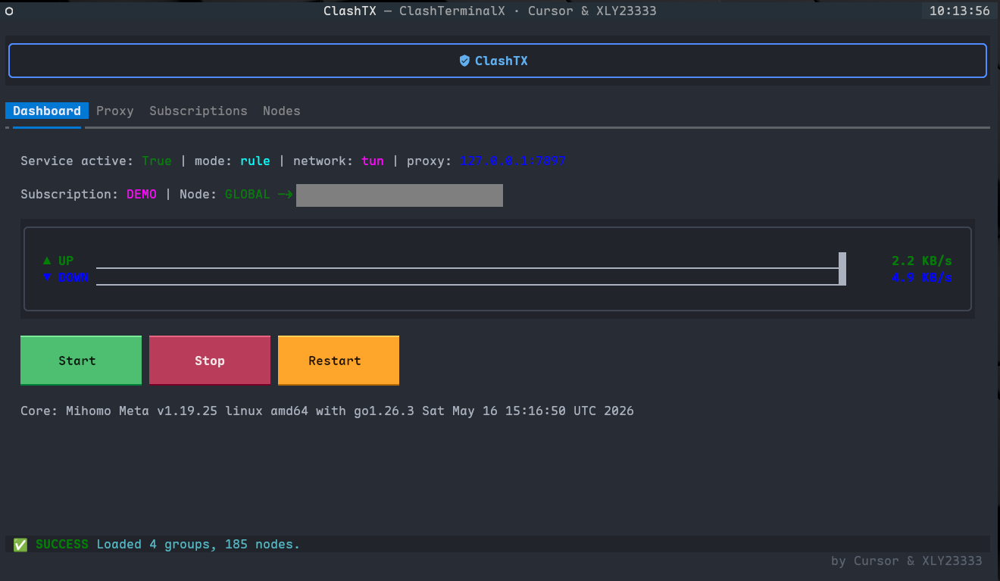
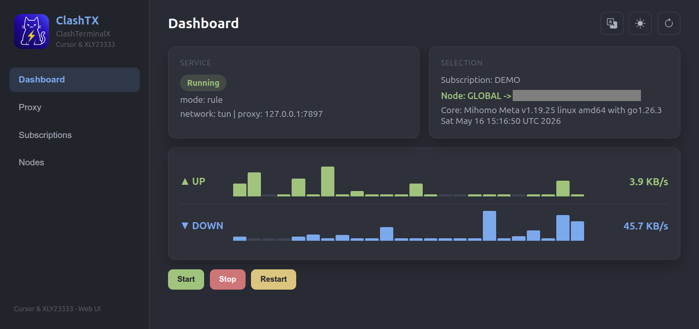

<div align="center">


# ClashTX

**ClashTerminalX** — 面向 Linux 的终端优先 Mihomo/Clash 管理工具。

<p align="center">
  <a href="https://www.python.org/">
    
  </a>
  <a href="https://kernel.org/">
    
  </a>
  <a href="https://github.com/MetaCubeX/mihomo">
    
  </a>
  <a href="https://github.com/Textualize/textual">
    
  </a>
</p>

通过 **Textual TUI**、**FastAPI Web UI** 或轻量 **CLI**，管理订阅、代理组、延迟测试、系统代理与 TUN 模式。

[English](./README.md) | **简体中文**

</div>

---

## 功能特性

| 功能 | 描述 |
| --- | --- |
| **仪表盘** | 服务状态、实时流量、核心版本 |
| **订阅** | 添加、更新、激活、删除 Mihomo YAML 订阅 |
| **节点** | 代理组选择、延迟排序、单节点 / 批量测速 |
| **代理** | 系统代理（GNOME + Shell 环境变量）与 Mihomo 混合端口设置 |
| **网络模式** | **System**（系统代理）与 **TUN**（全局隧道），互斥切换 |
| **界面** | Textual TUI · Web UI（`:7887`）· CLI 自动化 |

运行时数据默认存放在 `.runtime/`，与 Clash Verge 及其他本地 Clash 客户端隔离。首次启动时会自动把 `vendor/geodata/` 中的 GeoIP / GeoSite 数据库复制到配置目录，避免从 GitHub 下载失败。

---

## 快速开始

```bash
git clone <your-repo-url> ClashTX
cd ClashTX

./scripts/install.sh
sudo ./clashtx.sh help
sudo ./clashtx.sh start
sudo ./clashtx.sh          # 打开 TUI
sudo ./clashtx.sh ui       # 打开 Web UI：http://127.0.0.1:7887
```

安装脚本会创建 `.venv`、安装依赖，并在仓库根目录生成 `clashtx.sh`。

---

## 终端 TUI

启动终端界面：

```bash
sudo ./clashtx.sh
```

TUI 适合键盘优先的服务器使用场景。你可以在这里查看服务状态和实时流量、管理订阅、切换代理组、执行节点延迟测试，并切换 System / TUN 网络模式。



常用快捷键：

- `r` 刷新仪表盘、代理和节点数据。
- `s` 启动 Mihomo 核心。
- `x` 停止 Mihomo 核心。
- `q` 退出 TUI。

---

## Web UI

启动浏览器界面：

```bash
sudo ./clashtx.sh ui
```

然后打开 [http://127.0.0.1:7887](http://127.0.0.1:7887)。如果需要绑定到其他地址或端口，可以使用 `--host` 和 `--port`：

```bash
sudo ./clashtx.sh ui --host 0.0.0.0 --port 7887
```

Web UI 提供与 TUI 相同的核心控制能力，并支持 EN / 简体中文双语切换、深色 / 浅色模式、订阅管理、代理模式控制、节点测速和实时流量图表。



---

## 命令一览

| 命令 | 说明 |
| --- | --- |
| `sudo ./clashtx.sh` | 启动 Textual TUI |
| `sudo ./clashtx.sh ui [--host HOST] [--port PORT]` | 启动 Web UI（默认 `:7887`） |
| `sudo ./clashtx.sh start` | 启动 Mihomo 核心 |
| `sudo ./clashtx.sh stop` | 停止 Mihomo 核心 |
| `sudo ./clashtx.sh restart` | 重启 Mihomo 核心 |
| `sudo ./clashtx.sh status` | 查看服务状态 |
| `sudo ./clashtx.sh mode system` | 系统代理模式（关闭 TUN，启用代理） |
| `sudo ./clashtx.sh mode tun` | TUN 模式（关闭系统代理） |
| `source ./clashtx.sh source` | 在当前 Shell 加载 `proxy.env` |
| `source ./clashtx.sh start` | 启动核心并自动加载 `proxy.env` |
| `source ./clashtx.sh restart` | 重启核心并自动加载 `proxy.env` |
| `sudo ./clashtx.sh help` | 显示帮助 |

---

## 网络模式

### System 模式

- 关闭 TUN 并重新生成 `mihomo.yaml`
- 自动启用系统代理（GNOME + `proxy.env`）
- 适合遵循系统 / Shell 代理设置的应用

### TUN 模式

- 关闭系统代理，并在配置中启用 Mihomo TUN
- 需要 `/dev/net/tun` 以及 Mihomo 二进制文件的 **CAP_NET_ADMIN** 权限

一次性配置：

```bash
./vendor/tun/grant-caps.sh
# 或
sudo setcap cap_net_admin,cap_net_bind_service+ep vendor/mihomo/verge-mihomo
```

替换 Mihomo 二进制文件后需重新授权。TUN 辅助脚本位于 `vendor/tun/`。

---

## 项目结构

```
ClashTX/
├── asset/LOGO.png          # 品牌 Logo（源文件）
├── asset/img-terminal.png  # 终端 TUI 截图
├── asset/img-webui.png     # Web UI 截图
├── clashtx.sh              # 入口脚本（由 install.sh 生成）
├── scripts/install.sh
├── src/clashtx/            # 应用源码
│   ├── tui/                # Textual TUI
│   ├── web/                # FastAPI + 静态 Web UI
│   ├── controller.py       # 共享业务逻辑
│   └── system/             # 服务、代理、TUN、网络
├── vendor/
│   ├── mihomo/             # 内置 Mihomo 核心
│   ├── geodata/            # 内置 GeoIP / GeoSite 数据库
│   └── tun/                # TUN 配置脚本
└── .runtime/               # 配置、日志、PID（默认）
```

默认混合代理端口：**7897**（与 Clash Verge 对齐）。

---

## 配置

可通过环境变量覆盖运行时目录：

| 变量 | 用途 |
| --- | --- |
| `CLASHTX_CONFIG_DIR` | 配置与订阅 |
| `CLASHTX_DATA_DIR` | 核心数据 |
| `CLASHTX_CACHE_DIR` | 日志与 PID 文件 |
| `CLASHTX_CORE_PATH` | 自定义 Mihomo 二进制路径 |
| `CLASHTX_TUN_DIR` | 自定义 TUN 工具目录 |

---

## 许可证

ClashTX 使用 **GNU General Public License v3.0** 发布。详见 [LICENSE](./LICENSE)。

